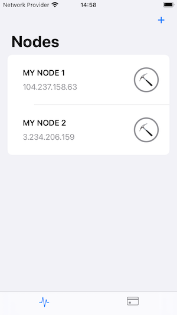
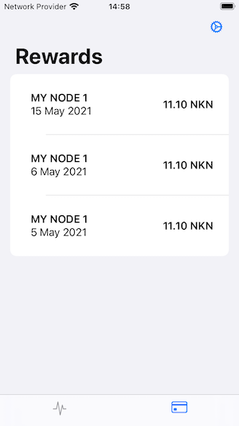

# NKN Mining Dashboard

## Introduction

[NKN (New Kind of Network)](https://nkn.org/) is a project that seeks to build a fast, secure and private general purpose peer-to-peer network.  To reward people for sharing their bandwidth the project uses the blockchain to give rewards to nodes, in the form of NKN tokens.

This repository is an iOS app that monitors the state of NKN nodes, to indicate whether they're mining or not.  It also monitors an NKN wallet address, to show what rewards have been received.

## Getting started

To run the app:
1. Clone the repository
2. Open src/NKN Mining Dashboard.xcodeproj in xcode
3. In the project settings, under Signing & Capabilities, set the signing team to your own team
4. Build
5. Run
6. Enjoy

## Using the app

### Monitoring nodes

The first tab in the app shows a list of NKN nodes.  Each node has an emoji indicating its state:

|Emoji|Description|
|-|-|
|⛏|The node is mining|
|❌|The node isn't mining|
|?|The node's state can't be determined|

To add a node to the list tap the + button and enter the node's IP address, along with a name that will help you identify it.  When you tap the Done button the app tries to contact the node to retrieve it's public key.  For this reason a node must be online when you try to add it to the app.

### Monitoring rewards

The second tab shows a list of mining rewards received by your wallet.  The amount and date of each reward is shown, along with the name of the node that earned it.  To configure the wallet address tap the cog button.

## Technologies used

The app is written in Swift, using SwiftUI for the view layer.  Swift Package Manager is used to manage dependencies, [Dip](https://github.com/AliSoftware/Dip) for dependency injection , [Alamofire](https://github.com/Alamofire/Alamofire) for the networking layer and CoreData for persistence.  It's architected according to the MVVM pattern.